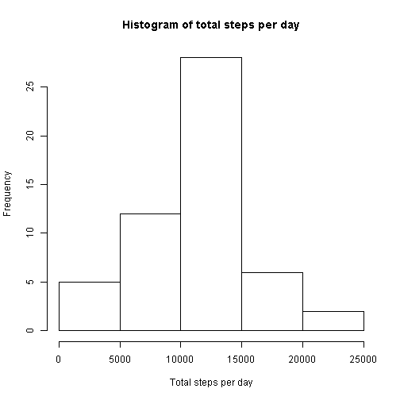
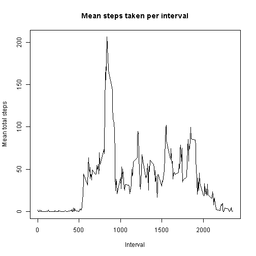
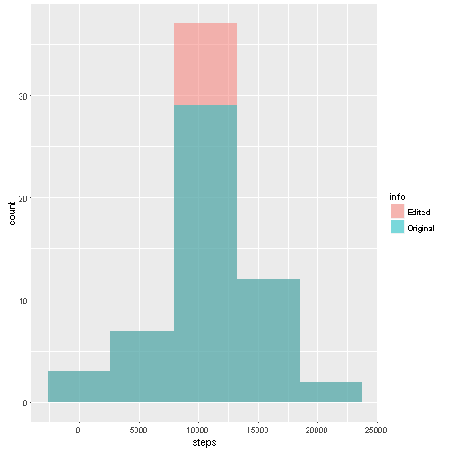
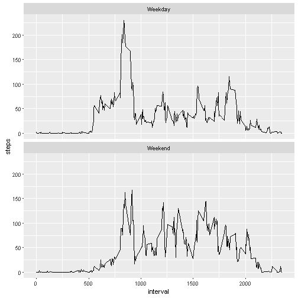

```r
library(knitr)
opts_chunk$set(echo = TRUE)
```

## Reading .csv file, and then aggregating the data by date while omitting missing values.


```r
inputData <- read.csv("activity.csv")
byDaySum  <- aggregate(steps ~ date, data = inputData, FUN = sum)
```

## Plotting a histogram of total steps per day:


```r
hist(byDaySum$steps, main = "Histogram of total steps per day", xlab = "Total steps per day")
```



## Calculating and reporting mean and median.

```r
totalMean   <- round(mean(byDaySum$steps))
totalMedian <- round(median(byDaySum$steps))
```

The mean of total number of steps taken per day is 1.0766 &times; 10<sup>4</sup>. The median is 1.0765 &times; 10<sup>4</sup>.

## Calculating average steps per interval and plotting a time trace.


```r
intervalMean <- aggregate(steps ~ interval, data = inputData, FUN = mean)
plot(intervalMean$interval, intervalMean$steps, type = "l", main = "Mean steps taken per interval", ylab = "Mean total steps", xlab = "Interval")
```



```r
# Finding interval with maximum number of mean steps.
maxInterval <- intervalMean[which(intervalMean$steps==max(intervalMean$steps)),1]
```

The interval with the highest mean total steps is 835.

## Imputing missing values

Missing interval will be filled with the mean steps per interval (for each specific interval).

```r
# First I will calculate the number of rows with missing values.
numOfNa   <- sum(is.na(inputData$steps))
whereIsNa <- which(is.na(inputData$steps))

# Now I'm going to find which NA belongs to which interval, look for the interval in the means data frame I computed in the previous wtepm and then assign that mean value in the correct interval.
dataEdited <- inputData
for (i in 1:length(whereIsNa)){
        posOfInterval                  <- which(intervalMean$interval==inputData$interval[i]) # Remembering interval to take.
        dataEdited$steps[whereIsNa[i]] <- intervalMean$steps[posOfInterval]                   # Assigning values.
}
```

The total number of missing values in the dataset is `numOfNa`.


```r
# Histogramming
# First calculating the sum of steps per day for the new dataset.
library(ggplot2)
byDayEdited      <- aggregate(steps ~ date, data = dataEdited, FUN = sum)
byDaySum$info    <- 'Original'
byDayEdited$info <- 'Edited'
allData          <- rbind(byDayEdited,byDaySum)
ggplot(allData, aes(steps, fill = info), alpha = .5) + geom_histogram(alpha = 0.5, bins = 5, position = 'identity')
```



```r
totalMeanEdited   <- round(mean(byDayEdited$steps))
totalMedianEdited <- round(median(byDayEdited$steps))
```
The mean of total number of steps taken per day, while imputing missing values, is 1.0766 &times; 10<sup>4</sup>. The median is 1.0766 &times; 10<sup>4</sup>.  
From the histogram, we see that imputing missing values increases the bar that is mostly related to the mean total number of steps per day. That is not surprising, since I used the mean total per intercal to fill in for missing values, hence each day that had missing values became an avergae day. Moreover, the same effect can be seen while looking at the new values for the mean and the median, as they barely changed.  

## Checking for differences between weekend and weekdays

```r
weekDaysNames <- c('Monday', 'Tuesday', 'Wednesday', 'Thursday', 'Friday')
# Creating a factor that will include the info whether the date is of a weekday or a weekend.
dataEdited$dayType <- factor((weekdays(as.Date(dataEdited$date)) %in% weekDaysNames), levels = c(T,F), labels = c('Weekday','Weekend'))
# Splitting the data to weekends and weekdays and calculating average number of steps per interval for each.
intervalMeanEdited <- aggregate(steps ~ interval + dayType, data = dataEdited, FUN = mean)
p <- ggplot(data = intervalMeanEdited, aes(x= interval, y = steps)) + geom_line()
p + facet_wrap(~dayType, nrow = 2)
```


